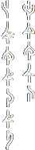
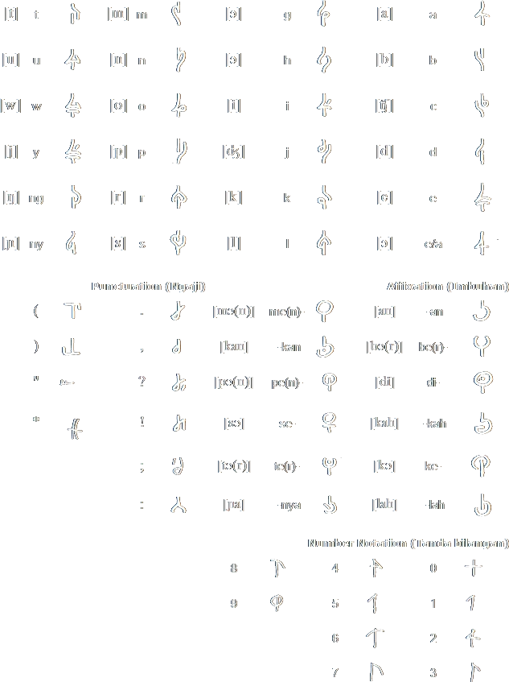

<h1 align="center"><strong>Beka Melayu Typeface - Modernized version<strong></h1>
  
  

    Beka Melayu Typeface based on surat beringin script, modernized version with rounded sans serif like style for font structures, WIP.
  

  <a 
    href="https://omniglot.com/conscripts/suratberingin.htm"><strong>Original Project source</strong>
  </a>

<!-- Contents -->
## Update

This project will not receiving anymore updates in future! Create new pull request if you want to include your changes. TQ

*** This readme was translated using <strong>Google Translate</strong>

<!-- Contents -->

  
Contents

  <ol>
    <li><a href="#roadmap">Roadmap</a></li>
    <li><a href="#characters">Characters</a></li>
    <li><a href="#contributing">Contributing</a></li>
    <li><a href="#license">License</a></li>
    <li><a href="#acknowledgements">Acknowledgments</a></li>
  </ol>

<!-- ROADMAP -->
## Roadmap

  

- Base concept and stylization
    - Conceptual design into working environment
        - Reconverted into SVG working format
    - Handmade redesign based on rounded sans serif style fonts
        - Review needed ( General review passed early test )
- minor alteration using `Sans` based design to missing original concept in alphabet table, stick to original conceptual font as much as possible
- Repackages the `glif` files ( `*Glyph` )
- Non-vital files and core project files was .gitignores in repositories

 

<!-- CHARACTERS -->
## Characters

Original typeface was based on Surat Beringin script. Surat Beringin is a way to write Beka Malayu, a version of Malay from which non-Austronesian elements have been removed and replaced with words based on Austronesian roots.

        
    

 

<!-- Contributing -->
## Contributing

If you have a suggestion that would make this website better, please [open issues](https://github.com/shoen1x/Beka-Melayu-Script/issues). You can also simply open an issue with the tag "enhancement".
Don't forget to give the project a star! Thanks again!

1. Identify the problem or suggestions
2. Create your new [open issues](https://github.com/shoen1x/Beka-Melayu-Script/issues)
3. Submit

[![Contributors][contributors-shield]][contributors-url]
[![Issues][issues-shield]][issues-url]

<!-- License -->
## License

Distributed under the 'MIT License' License. See `LICENSE.md` for more information.
 
[MIT License](https://choosealicense.com/licenses/mit/)

[![License][license-shield]][license-url]

<!-- Ackdnowledgements -->
## Acknowledgements

 - [Beka Melayu Original Project](https://omniglot.com/conscripts/suratberingin.htm) for base template
 - [FontCreator](https://www.high-logic.com/font-editor/fontcreator)
 - [Original alphabet databank](https://omniglot.com/charts/suratberingin.xls)

(<a href="#readme-top">back to top</a>)

<!-- https://www.markdownguide.org/basic-syntax/#reference-style-links -->
[contributors-shield]: https://img.shields.io/github/contributors/shoen1x/Beka-Melayu-Script.svg?style=for-the-badge
[contributors-url]: https://github.com/shoen1x/Beka-Melayu-Script/graphs/contributors
[issues-shield]: https://img.shields.io/github/issues/shoen1x/Beka-Melayu-Script.svg?style=for-the-badge
[issues-url]: https://github.com/shoen1x/Beka-Melayu-Script/issues
[license-shield]: https://img.shields.io/github/license/shoen1x/Beka-Melayu-Script.svg?style=for-the-badge
[license-url]: https://github.com/shoen1x/Beka-Melayu-Script/blob/master/LICENSE.txt
